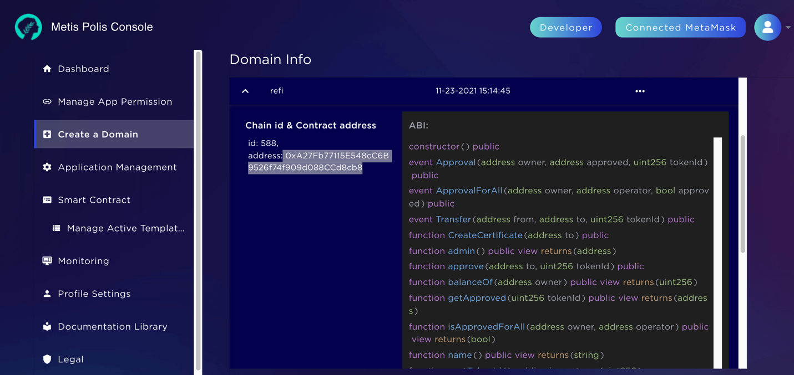

# How to deploy Contract to Metis

## Requirements

- Hardhat: https://hardhat.org/
- A polis account linked with metamask https://polis.metis.io/#/login

For faucet and tesnet config for metamask see https://docs.metis.io/building-on-metis/connection-details#testnet-rinkeby

## Config hardhat to metamask

https://docs.metis.io/building-on-metis/your-first-deployment#add-metis-network-options-to-hardhat-config

Compile with `yarn hardhat compile`

Add the following line into your .env file (removing the `0x` prefix)

`PRIVATE_KEY=<PRIVATE_KEY_FROM_METAMASK>`

Import into your account some test token, see https://docs.metis.io/building-on-metis/getting-test-tokens

Deploy running `yarn hardhat run scripts/deploy.ts --network metis`

Example: https://stardust-explorer.metis.io/address/0xA27Fb77115E548cC6B9526f74f909d088CCd8cb8/transactions

## Port address to domain metis

Go to: https://polis.metis.io/#/create-domain

Create a domain and copy address, ABI from step 4 

Then you can login and auth via polis from domain